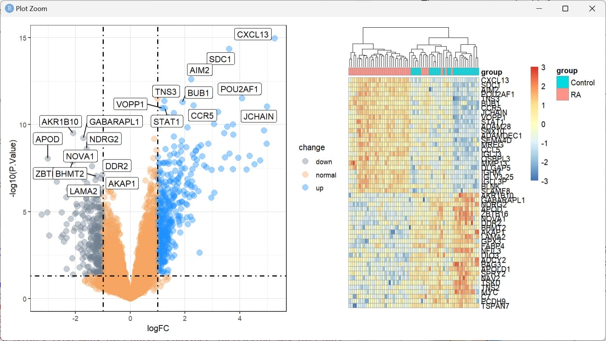

# doi.org/10.3389/fimmu.2024.1387311

## Basic Info

* **Title**: Machine learning and weighted gene co-expression network analysis identify a three-gene signature to diagnose rheumatoid arthritis
* **标题**：[机器学习 和 加权基因共表达网络] 分析识别出一个 (用于诊断类风湿关节炎的) 三基因标记物组合

---

* **方向**：自身免疫性疾病 - 类风湿性关节炎 RA
* **对象**：患者 vs 健康：滑膜
* **问题**：RA诊断相关的关键基因是？
* **方法**：加权基因共表达网络分析 WGCNA；随机森林 RF；支持向量机-递归特征消除 SVM-RFE；最小绝对收缩和选择算子 LASSO
* **结论**：RRM2, DLGAP5, KIF11


创新点？

* 机器学习
* 「验证集」的思想

---

可以进一步提出的问题 (By MS Copilot via GPT-4)

* **免疫细胞浸润**：这些关键基因与哪些特定的免疫细胞类型有关联？它们如何影响RA的发展？
* **治疗潜力**：这些基因是否可以作为药物靶点？针对这些基因的治疗策略是否可行？
* **诊断准确性**：这些基因作为生物标志物的敏感性和特异性如何？是否适用于所有RA患者？
* **后续研究**：如何通过实验验证这些基因的功能和它们在RA中的作用？

## Reproduction

### Figure 01

* 内容：流程图
* 目的：展示此文章研究流程


复现：[draw.io](https://app.diagrams.net/)


---


复现：节选自 [rep_01_2_dl.R](rep_01_2_dl.R)

```r
dat_55457 = c(
  "GSE55457",
  GSE55457@annotation,
  sum(!str_detect(GSE55457$characteristics_ch1, 'osteoarthritis')),
  sum(str_detect(GSE55457$characteristics_ch1, 'control')),
  sum(str_detect(GSE55457$characteristics_ch1, 'rheumatoid'))
)

df = data.frame(rbind(dat_55235, dat_77298, dat_12021, dat_55457))
colnames(df) = headers
rownames(df) = c(1, 2, 3, 4)
```


---

* 复现评价：优
* 概念理解：完全

**注**：原作者犯了低级错误：
把平台 GPL 打成 GLP，
**而且数据集和平台的对应关系错误** (double checked)，
提示我们能生成尽量不要手打。

### Data Processing

本文数据处理难度较大：
* 三个分析数据集，使用的平台不同
* 数据集含有骨关节炎 osteoarthritis 样本，需排除

详见 [rep_01_3_dp.R](rep_01_3_dp.R)

### Figure 02

* 内容
  * 火山图 (volcano plot)
  * 差异基因热图 (DEG heat map)
* 目的：展示**差异**表达基因

> DEG
> 
> Differentially expressed genes (DEGs) were identified using the limma package with |log Fold Change (FC)| ≥ 1 and P-value < 0.05 used as the cutoff for filtering the DEGs (14).
> 
> DEGs were visualized using a heatmap and volcano map obtained by using pheatmap and ggplot2 packages.
> 
> ---
> 
> A total of 575 DEGs (including 383 upregulated genes and 192 downregulated genes) were identified between RA and normal samples. The top 10 upregulated and downregulated DEGs are presented in a volcano plot (Figure 2A). In addition, the expression levels of the 25 most upregulated and 25 most downregulated genes are shown in a heatmap (Figure 2B).


复现：详见 [rep_02_deg.R](rep_02_deg.R)



* 复现评价：
  * 火山图：优 (格式一致，数据基本一致)
  * 热图：中 (格式一致，数据不一致)
* 概念理解：完全

### Figure 03

* 内容：富集分析
  * GO Enrichment
  * KEGG Enrichment
  * GSEA Analysis
  * GSVA Analysis
* 目的：展示**富集**分析结果


复现：详见 [rep_03_enrich.R](rep_03_enrich.R)

(缺图)

(Figure 03 - D 难度过大，暂时跳过)

* 复现评价：
  * GO Enrichment: 中 (格式基本一致，数据基本一致)
  * KEGG Enrichment: 良 (格式一致，数据不一致)
  * GSEA Analysis: 良 (格式一致，数据不一致)
  * GSVA Analysis: 失败
* 概念理解：较弱

### Figure 04

* 内容：WGCNA
  * Scale independence & Mean connectivity
  * Gene dendrogram & Module colors
  * Module-trait relationships
  * Module membership vs Gene significance
* 目的：展示 WGCNA 分析结果
  * WGCNA: Weighted Gene Co-expression Network Analysis 加权基因共表达网络分析
